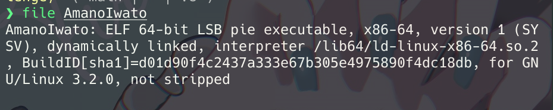
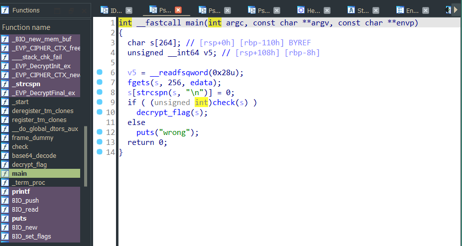
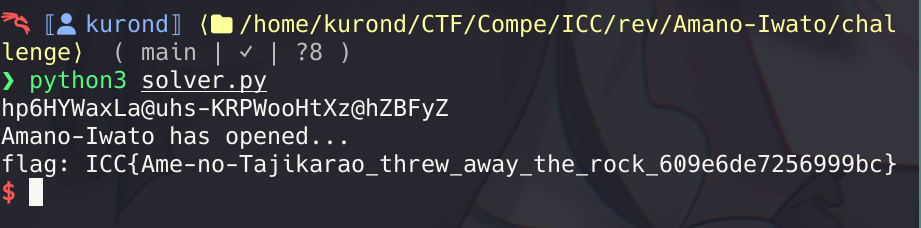

# tags: rev, flag checker | origin: ICC | date: 2026-02-22
# Amano-Iwato

# Early Analysis
We are given a binary. Let's try to check information it's have using `file` command

Its not stripped and dynamically linked. Let's try to use IDA to decompile this binary since its not stripped it will easy to analyze

Alright, we got the decompiled code. Intuitively, We can get the idea the `main` will ask for input. Check that input and if its "correct", then it will decrypt the flags.

For now, let's jump on that `check` function
```C
_BOOL8 __fastcall check(__int64 a1)
{
  if ( strlen((const char *)a1) != 32 )
    return 0LL;
  if ( (*(_BYTE *)(a1 + 19) & *(_BYTE *)(a1 + 23)) != 72 )
    return 0LL;
  if ( (*(_BYTE *)(a1 + 24) ^ *(_BYTE *)(a1 + 15)) != 49 )
    return 0LL;
  if ( *(_BYTE *)(a1 + 30) - *(_BYTE *)a1 != 17 )
    return 0LL;
  if ( *(_BYTE *)(a1 + 31) * *(_BYTE *)(a1 + 12) != 0x90 )
    return 0LL;
  if ( *(_BYTE *)(a1 + 26) * *(_BYTE *)(a1 + 10) )
    return 0LL;
  if ( *(_BYTE *)(a1 + 29) * *(_BYTE *)(a1 + 13) != 114 )
    return 0LL;
  if ( *(_BYTE *)(a1 + 17) + *(_BYTE *)(a1 + 14) != 125 )
    return 0LL;
  if ( *(_BYTE *)(a1 + 28) - *(_BYTE *)(a1 + 27) != 0xE8 )
    return 0LL;
  if ( (*(_BYTE *)(a1 + 1) | *(_BYTE *)(a1 + 21)) != 120 )
    return 0LL;
  if ( (*(_BYTE *)(a1 + 2) ^ *(_BYTE *)(a1 + 22)) != 66 )
    return 0LL;
  if ( (*(_BYTE *)(a1 + 20) ^ *(_BYTE *)(a1 + 3)) != 39 )
    return 0LL;
  if ( (*(_BYTE *)(a1 + 8) ^ *(_BYTE *)(a1 + 9)) != 45 )
    return 0LL;
  if ( *(_BYTE *)(a1 + 25) * *(_BYTE *)(a1 + 18) != 0xC0 )
    return 0LL;
  if ( (*(_BYTE *)(a1 + 16) | *(_BYTE *)(a1 + 7)) != 122 )
    return 0LL;
  if ( (*(_BYTE *)(a1 + 6) ^ *(_BYTE *)(a1 + 11)) != 20 )
    return 0LL;
  if ( *(_BYTE *)(a1 + 5) + *(_BYTE *)(a1 + 4) != 0xB0 )
    return 0LL;
  if ( (*(_BYTE *)(a1 + 21) ^ *(_BYTE *)(a1 + 28)) != 10 )
    return 0LL;
  if ( *(_BYTE *)(a1 + 4) + *(_BYTE *)(a1 + 23) != 0xB1 )
    return 0LL;
  if ( *(_BYTE *)(a1 + 9) - *(_BYTE *)(a1 + 19) != 0xF2 )
    return 0LL;
  if ( (*(_BYTE *)(a1 + 10) & *(_BYTE *)(a1 + 1)) != 64 )
    return 0LL;
  if ( (*(_BYTE *)(a1 + 12) & *(_BYTE *)a1) != 104 )
    return 0LL;
  if ( *(_BYTE *)(a1 + 5) + *(_BYTE *)(a1 + 18) != 0xAE )
    return 0LL;
  if ( (*(_BYTE *)(a1 + 27) | *(_BYTE *)(a1 + 24)) != 122 )
    return 0LL;
  if ( (*(_BYTE *)(a1 + 22) | *(_BYTE *)(a1 + 30)) != 125 )
    return 0LL;
  if ( (*(_BYTE *)(a1 + 7) & *(_BYTE *)(a1 + 13)) != 112 )
    return 0LL;
  if ( *(_BYTE *)(a1 + 16) - *(_BYTE *)(a1 + 17) != 2 )
    return 0LL;
  if ( *(_BYTE *)(a1 + 8) * *(_BYTE *)(a1 + 3) != 96 )
    return 0LL;
  if ( *(_BYTE *)(a1 + 26) * *(_BYTE *)(a1 + 6) != 104 )
    return 0LL;
  if ( *(_BYTE *)(a1 + 11) - *(_BYTE *)(a1 + 2) != 63 )
    return 0LL;
  if ( (*(_BYTE *)(a1 + 25) | *(_BYTE *)(a1 + 29)) != 70 )
    return 0LL;
  if ( *(_BYTE *)(a1 + 15) + *(_BYTE *)(a1 + 14) != 120 )
    return 0LL;
  if ( *(_BYTE *)(a1 + 20) + *(_BYTE *)(a1 + 31) != 0xC9 )
    return 0LL;
  if ( *(_BYTE *)(a1 + 22) * *(_BYTE *)(a1 + 7) != 96 )
    return 0LL;
  if ( (*(_BYTE *)(a1 + 25) ^ *(_BYTE *)(a1 + 16)) != 18 )
    return 0LL;
  if ( *(_BYTE *)(a1 + 13) + *(_BYTE *)(a1 + 12) != 0xDB )
    return 0LL;
  if ( *(_BYTE *)(a1 + 24) * *(_BYTE *)(a1 + 14) != 114 )
    return 0LL;
  if ( *(_BYTE *)(a1 + 6) - *(_BYTE *)(a1 + 10) != 33 )
    return 0LL;
  if ( *(_BYTE *)(a1 + 18) * *(_BYTE *)(a1 + 23) != 0xE8 )
    return 0LL;
  if ( (*(_BYTE *)(a1 + 29) | *(_BYTE *)a1) != 110 )
    return 0LL;
  if ( *(_BYTE *)(a1 + 8) + *(_BYTE *)(a1 + 15) != 0x97 )
    return 0LL;
  if ( (*(_BYTE *)(a1 + 30) | *(_BYTE *)(a1 + 4)) != 121 )
    return 0LL;
  if ( (*(_BYTE *)(a1 + 1) & *(_BYTE *)(a1 + 31)) != 80 )
    return 0LL;
  if ( *(_BYTE *)(a1 + 28) - *(_BYTE *)(a1 + 26) != 0xDA )
    return 0LL;
  if ( *(_BYTE *)(a1 + 11) + *(_BYTE *)(a1 + 20) != 0xE4 )
    return 0LL;
  if ( *(_BYTE *)(a1 + 21) - *(_BYTE *)(a1 + 17) != 0xF8 )
    return 0LL;
  if ( *(_BYTE *)(a1 + 5) - *(_BYTE *)(a1 + 27) != 0xFD )
    return 0LL;
  if ( (*(_BYTE *)(a1 + 9) ^ *(_BYTE *)(a1 + 3)) != 41 )
    return 0LL;
  if ( (*(_BYTE *)(a1 + 2) ^ *(_BYTE *)(a1 + 19)) != 89 )
    return 0LL;
  if ( (*(_BYTE *)(a1 + 23) & *(_BYTE *)(a1 + 29)) != 64 )
    return 0LL;
  if ( *(_BYTE *)(a1 + 3) + *(_BYTE *)(a1 + 17) != 0x98 )
    return 0LL;
  if ( *(_BYTE *)(a1 + 7) - *(_BYTE *)(a1 + 28) != 54 )
    return 0LL;
  if ( (*(_BYTE *)(a1 + 31) | *(_BYTE *)(a1 + 22)) != 126 )
    return 0LL;
  if ( *(_BYTE *)(a1 + 27) + *(_BYTE *)(a1 + 26) != 0xC2 )
    return 0LL;
  if ( (*(_BYTE *)(a1 + 16) | *(_BYTE *)(a1 + 5)) != 87 )
    return 0LL;
  if ( *(_BYTE *)(a1 + 25) * *(_BYTE *)(a1 + 14) != 64 )
    return 0LL;
  if ( *(_BYTE *)(a1 + 8) + *(_BYTE *)(a1 + 10) != 0x8C )
    return 0LL;
  if ( (*(_BYTE *)(a1 + 19) ^ *(_BYTE *)(a1 + 6)) != 14 )
    return 0LL;
  if ( *(_BYTE *)(a1 + 13) + *(_BYTE *)(a1 + 20) != 0xE2 )
    return 0LL;
  if ( (*(_BYTE *)(a1 + 30) & *(_BYTE *)(a1 + 21)) != 72 )
    return 0LL;
  if ( *(_BYTE *)(a1 + 2) - *(_BYTE *)(a1 + 1) != 0xC6 )
    return 0LL;
  if ( (*(_BYTE *)(a1 + 15) & *(_BYTE *)(a1 + 11)) != 65 )
    return 0LL;
  if ( *(_BYTE *)(a1 + 9) * *(_BYTE *)(a1 + 4) != 0xB9 )
    return 0LL;
  if ( *(_BYTE *)(a1 + 18) + *(_BYTE *)a1 != 0xBF )
    return 0LL;
  if ( *(_BYTE *)(a1 + 12) * *(_BYTE *)(a1 + 24) != 0x90 )
    return 0LL;
  if ( (*(_BYTE *)(a1 + 24) & *(_BYTE *)(a1 + 11)) != 112 )
    return 0LL;
  if ( (*(_BYTE *)(a1 + 30) & *(_BYTE *)a1) != 104 )
    return 0LL;
  if ( *(_BYTE *)(a1 + 8) * *(_BYTE *)(a1 + 20) != 0xF4 )
    return 0LL;
  if ( (*(_BYTE *)(a1 + 14) | *(_BYTE *)(a1 + 1)) != 125 )
    return 0LL;
  if ( *(_BYTE *)(a1 + 5) + *(_BYTE *)(a1 + 29) == 0x9D )
    return *(_BYTE *)(a1 + 12) - *(_BYTE *)(a1 + 9) == 7;
  return 0LL;
}
```

Alright !! it's clear that this is flag checker type. There is bunch of "rules" that do some arithmetic to each byte or each character in the input to expect some value. 

## Solving
So since this mostly linear arithmetic and bitwise operations, we can just use Z3 solver to generate the valid string. We will just "copy" all the rules that exist in the `check` function. Also, I will use `pwntools` just for automate sending the string so I don't need to copy and paste.
```python
from z3 import *
from pwn import *

a = [BitVec(f'a{i}', 8) for i in range(32)]
s = Solver()
for i in range(32):
    s.add(a[i] != 0)

s.add((a[19] & a[23]) == 72)
s.add((a[24] ^ a[15]) == 49)
s.add(a[30] - a[0] == 17)
s.add(a[31] * a[12] == 0x90)
s.add(a[26] * a[10] == 0)
s.add(a[29] * a[13] == 114)
s.add(a[17] + a[14] == 125)
s.add(a[28] - a[27] == 0xE8)
s.add((a[1] | a[21]) == 120)
s.add((a[2] ^ a[22]) == 66)
s.add((a[20] ^ a[3]) == 39)
s.add((a[8] ^ a[9]) == 45)
s.add(a[25] * a[18] == 0xC0)
s.add((a[16] | a[7]) == 122)
s.add((a[6] ^ a[11]) == 20)
s.add(a[5] + a[4] == 0xB0)
s.add((a[21] ^ a[28]) == 10)
s.add(a[4] + a[23] == 0xB1)
s.add(a[9] - a[19] == 0xF2)
s.add((a[10] & a[1]) == 64)
s.add((a[12] & a[0]) == 104)
s.add(a[5] + a[18] == 0xAE)
s.add((a[27] | a[24]) == 122)
s.add((a[22] | a[30]) == 125)
s.add((a[7] & a[13]) == 112)
s.add(a[16] - a[17] == 2)
s.add(a[8] * a[3] == 96)
s.add(a[26] * a[6] == 104)
s.add(a[11] - a[2] == 63)
s.add((a[25] | a[29]) == 70)
s.add(a[15] + a[14] == 120)
s.add(a[20] + a[31] == 0xC9)
s.add(a[22] * a[7] == 96)
s.add((a[25] ^ a[16]) == 18)
s.add(a[13] + a[12] == 0xDB)
s.add(a[24] * a[14] == 114)
s.add(a[6] - a[10] == 33)
s.add(a[18] * a[23] == 0xE8)
s.add((a[29] | a[0]) == 110)
s.add(a[8] + a[15] == 0x97)
s.add((a[30] | a[4]) == 121)
s.add((a[1] & a[31]) == 80)
s.add(a[28] - a[26] == 0xDA)
s.add(a[11] + a[20] == 0xE4)
s.add(a[21] - a[17] == 0xF8)
s.add(a[5] - a[27] == 0xFD)
s.add((a[9] ^ a[3]) == 41)
s.add((a[2] ^ a[19]) == 89)
s.add((a[23] & a[29]) == 64)
s.add(a[3] + a[17] == 0x98)
s.add(a[7] - a[28] == 54)
s.add((a[31] | a[22]) == 126)
s.add(a[27] + a[26] == 0xC2)
s.add((a[16] | a[5]) == 87)
s.add(a[25] * a[14] == 64)
s.add(a[8] + a[10] == 0x8C)
s.add((a[19] ^ a[6]) == 14)
s.add(a[13] + a[20] == 0xE2)
s.add((a[30] & a[21]) == 72)
s.add(a[2] - a[1] == 0xC6)
s.add((a[15] & a[11]) == 65)
s.add(a[9] * a[4] == 0xB9)
s.add(a[18] + a[0] == 0xBF)
s.add(a[12] * a[24] == 0x90)
s.add((a[24] & a[11]) == 112)
s.add((a[30] & a[0]) == 104)
s.add(a[8] * a[20] == 0xF4)
s.add((a[14] | a[1]) == 125)
s.add(a[5] + a[29] == 0x9D)
s.add(a[12] - a[9] == 7)

if s.check() == sat:
    m = s.model()
    result = ''.join([chr(m[a[i]].as_long()) for i in range(32)])
    print(result)
else:
    print("No solution")
    
io = process('./AmanoIwato')
io.sendline(result.encode())
io.interactive()
```
# Result
